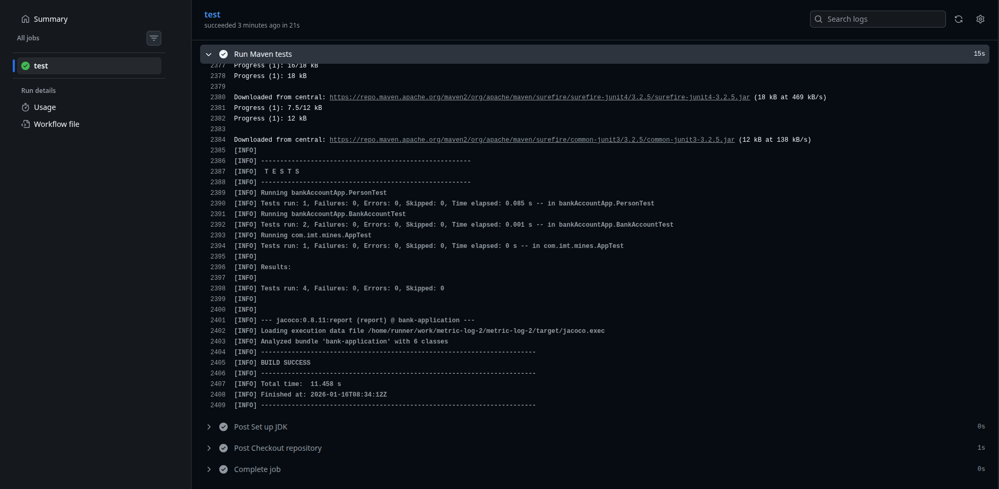
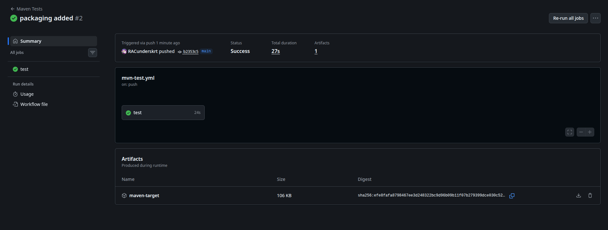

# Exercice 10

Dans le repository github, on crée une nouvelle action afin de tester notre projet à chaque push sur la branche `main`.
```yml
name: Maven Tests

on:
  push:
    branches:
      - main

jobs:
  test:
    runs-on: ubuntu-latest

    steps:
      - name: Checkout repository
        uses: actions/checkout@v4

      - name: Set up JDK
        uses: actions/setup-java@v4
        with:
          distribution: 'temurin'
          java-version: '17'

      - name: Run Maven tests
        run: mvn clean test
```

Suite à l'exécution de cette action, on peut vérifier si tout s'est bien passé dans notre navigateur.


Pour ajouter le packaging de l'application ainsi que la création d'un artefact contenant le dossier `target/`, on peut modifier notre yml de cette manière.

```yml
name: Maven Tests

on:
  push:
    branches:
      - main

jobs:
  test:
    runs-on: ubuntu-latest

    steps:
      - name: Checkout repository
        uses: actions/checkout@v4

      - name: Set up JDK
        uses: actions/setup-java@v4
        with:
          distribution: 'temurin'
          java-version: '17'

      - name: Test & Package application
        run: mvn clean package

      - name: Upload build artifact
        uses: actions/upload-artifact@v4
        with:
          name: maven-target
          path: target/
```

On peut remplacer l'étape `Run Maven Test` par celui du packaging car `mvn clean package` lance déjà `mvn test`, il est alors inutile de répéter l'opération dans plusieurs étapes.

