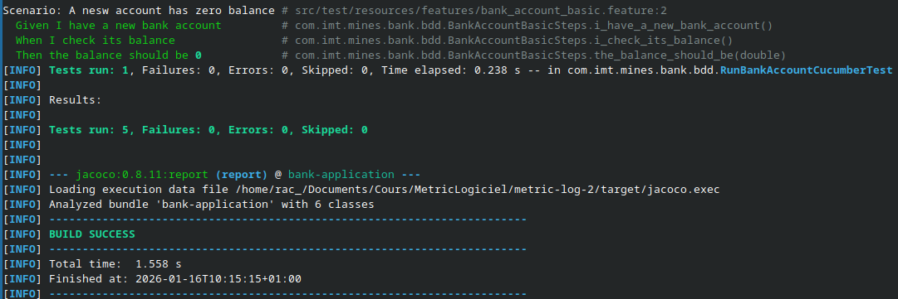

# Exercice 11

Dans le fichier `src/test/resources/features`, on peut créer nos features qui seront utilisées par Cucumber.
Dans notre exemple, on peut créer `bank_account_basic.feature` qui décrit un scénario.
Ce scénario étant que si un client de la bank a 0 euro sur son compte alors la fonction qui retourne la valeur de son compte doit être 0.

Ensuite on initialise les fichiers pour cucumber dans le dossier `src/test/java/com/imt/mines/bank/bdd`.
Dans le fichier `BankAccountBasicSteps.java`, on défini les étapes de notre scénario dans notre code.
```java
@Given("I have a new bank account")
public void i_have_a_new_bank_account() {
    account = new BankAccount(0, 10, "28/02/2016", null);
}

@When("I check its balance")
public void i_check_its_balance() {
    observedBalance = account.getBalance();
}

@Then("the balance should be {double}")
public void the_balance_should_be(double expected) {
    assertEquals(expected, observedBalance, 0.001);
}
```
Puis on peut lancer les tests et vérifier s'ils fonctionnent.
