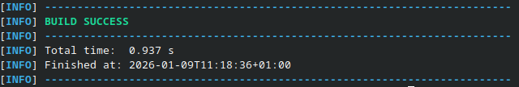

# Exercice 6

Pour créer un projet maven, on peut utiliser la commande :
```sh
mvn archetype:generate \
  -DgroupId=com.imt.mines \
  -DartifactId=bank-application \
  -Dversion=1.0-SNAPSHOT \
  -DarchetypeArtifactId=maven-archetype-quickstart \
  -DinteractiveMode=false
```

Ensuite, on copie les fichiers du dossier `/main` dans notre nouveau projet.
On peut à présent lancer la commande `mvn compile` à la racine de notre projet.

