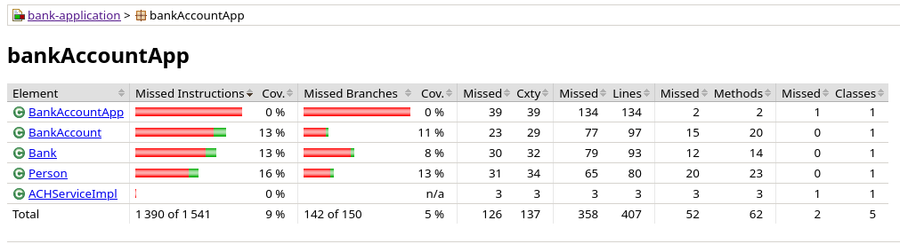
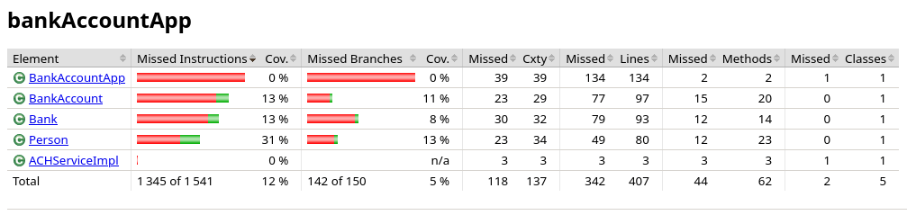

# Exercice 9

Avec les tests créés précédement, nous avons un rapport ressemblant à :


Afin de voir comment évolue le rapport avec l'ajout de test, on peut créer un nouveau test sur la classe `Person` dans le fichier `src/test/java/PersonTest.java`.

```java
    @Test
	public void test_default_values() {
		Person person = new Person();

		assertEquals("", person.getName());
		assertEquals('M', person.getGender());
		assertEquals(0, person.getAge());
		assertEquals(0.0, person.getHeight(), 0);
		assertEquals(0.0, person.getWeight(), 0);
		assertEquals("", person.getHairColor());
		assertEquals("", person.getEyeColor());
	}
```

Ce test vérifie si les valeurs par défaut d'un objet `Person` sont bien initialisés avec le constructeur par défaut.

Voici le rapport jacoco à la suite de cet ajout.


